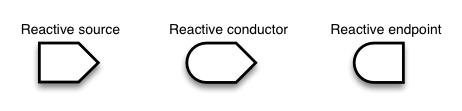

```{r setup, include=FALSE}
knitr::opts_chunk$set(echo = FALSE)
suppressMessages(library(ChemmineR))
suppressMessages(library(dplyr))
suppressMessages(library(knitr))
suppressMessages(library(kableExtra))
data(sdfsample)
```

## Textbook

1. [Mastering Shiny: Build Interactive Apps, Reports & Dashboards Powered by R](https://mastering-shiny.org/index.html)
2. [使用R Shiny設計資料科學應用程式](https://yjtseng.info/shinybook/)
3. [Learn Shiny](https://shiny.rstudio.com/tutorial/)


## What is Shiny?

+ An R package that makes it easy to build interactive web apps straight from R.
+ Not only can you host standalone apps on a web-page, but you can also embed them in R Markdown documents.
+ Shiny is a framework for creating web applications using R code.
+ Shiny apps are easy to write. ~~No web development skills are required.~~


## Major components of Shiny


## A simple example {.columns-2 .smaller}

### What you need is

+ Basic app
  - a single `app.R` file
  - app.R includes:
    * server function
    * ui function
  - Initiate the app by running code


### Use app.R as an example

```{r app_example, echo = TRUE, eval = FALSE}
library(shiny)
ui <- fluidPage()
server <- function(input, output) {}
shinyApp(ui = ui, server = server)
```


## Interactive Plot (Code)

```{r shiny_example2, echo = TRUE, eval = FALSE}
inputPanel(
  selectInput("n_breaks", label = "Number of bins:",
              choices = c(10, 20, 35, 50), selected = 20),
  
  sliderInput("bw_adjust", label = "Bandwidth adjustment:",
              min = 0.2, max = 2, value = 1, step = 0.2)
)

renderPlot({
  hist(faithful$eruptions, probability = TRUE, breaks = as.numeric(input$n_breaks),
       xlab = "Duration (minutes)", main = "Geyser eruption duration")
  
  dens <- density(faithful$eruptions, adjust = input$bw_adjust)
  lines(dens, col = "blue")
})
```

## Interactive Plot (View)

```{r eruptions}
inputPanel(
  selectInput("n_breaks", label = "Number of bins:",
              choices = c(10, 20, 35, 50), selected = 20),
  
  sliderInput("bw_adjust", label = "Bandwidth adjustment:",
              min = 0.2, max = 2, value = 1, step = 0.2)
)

renderPlot({
  hist(faithful$eruptions, probability = TRUE, breaks = as.numeric(input$n_breaks),
       xlab = "Duration (minutes)", main = "Geyser eruption duration")
  
  dens <- density(faithful$eruptions, adjust = input$bw_adjust)
  lines(dens, col = "blue")
})
```

## UI controls (1/2)


## UI controls (2/2)

```{r widgets, echo = FALSE, eval = TRUE}
functions <- c("actionButton",
              "checkboxGroupInput",
              "checkboxInput",
              "dateInput",
              "dateRangeInput",
              "fileInput",
              "helpText",
              "numericInput",
              "radioButtons",
              "selectInput",
              "sliderInput",
              "submitButton",
              "textInput")

widgets <- c("Action Button",
             "A group of check boxes",
             "A single check box",
             "A calendar to aid date selection",
             "A pair of calendars for selecting a date range",
             "A file upload control wizard",
             "Help text that can be added to an input form",
             "A field to enter numbers",
             "A set of radio buttons",
             "A box with choices to select from",
             "A slider bar",
             "A submit button",
             "A field to enter text")

data.frame(Functions = functions, Widgets = widgets) %>% kbl() %>% kable_styling(bootstrap_options = c("striped", "hover"), font_size=9)
```

## More tools for UI design

[Building a user interface](https://shiny.rstudio.com/tutorial/written-tutorial/lesson2/)


## Server - adding behavior

```{r shiny_example3, echo = TRUE, eval = FALSE}
ui <- fluidPage(
  selectInput("dataset", label = "Dataset", choices = ls("package:datasets")),
  verbatimTextOutput("summary"),
  tableOutput("table")
)

server <- function(input, output, session) {
  output$summary <- renderPrint({
    dataset <- get(input$dataset, "package:datasets")
    summary(dataset)
  })
  
  output$table <- renderTable({
    dataset <- get(input$dataset, "package:datasets")
    dataset
  })
}

shinyApp(ui, server)
```


## Reactivity (1/9)

>> In Shiny, there are three kinds of objects in reactive programming: reactive sources, reactive conductors, and reactive endpoints, which are represented with these symbols:



+ Simplest structure of a reactive programming


## Reactivity (2/9) - an example


```{r sample_code, echo = TRUE, eval = FALSE}
ui <- fluidPage(
  sidebarLayout(
    sidebarPanel(
      sliderInput("obs", "Number of observations:", min = 1, max = 1000, value = 500)),
    mainPanel(plotOutput("distPlot"))
  )
)

server <- function(input, output) {
  output$distPlot <- renderPlot({ hist(rnorm(input$obs)) })
}

```

+ How does reactive objects connect?


## Reactivity (3/9)


## Reactivity (4/9) - Reactive conductor


## Reactivity (5/9)


## Reactivity (6/9) - Reactive value, reactive expression, and observer

* [Ref](https://shiny.rstudio.com/articles/reactivity-overview.html)


## Reactivity (7/9) - Isolate

```{r shiny_example4, echo = TRUE, eval = FALSE}
ui <- pageWithSidebar(
  headerPanel("Click the button"),
  sidebarPanel(
    sliderInput("obs", "Number of observations:", min = 0, max = 1000, value = 500),
    actionButton("goButton", "Go!")
  ),
  mainPanel( plotOutput("distPlot") )
)

server <- function(input, output) {
  output$distPlot <- renderPlot({
    input$goButton
    dist <- isolate(rnorm(input$obs))
    hist(dist)
  })
}
```


## Reactivity (8/9) {.columns-2 .smaller}

###


### Before/After Press goButton


## Reactivity (9/9) - How to understand reactivity in R

[Ref](https://shiny.rstudio.com/articles/understanding-reactivity.html)


## Share your Shiny App

1. Share as R scripts
    + Packaging your shiny app into a zip file.
    + Others can use these functions to run the app, such as `runApp`, `runUrl`, `runGitHub`, `runGist`.
2. Share as a web page
    + Deploy it to [Shinyapps.io](http://www.shinyapps.io/)
    + Host it on a Shiny Server
    + Allow others to use your shiny apps through `RStudio Connect`


## Writing a better shiny app

1. Code organization
2. Testing
3. Management
4. Security
5. Performance


## More stuffs & issues in Shiny 

1. Shiny Framework Ecology

2. Accelerate your shiny app
 
[Slides](https://docs.google.com/presentation/d/15IsVYqoqPYrP_mvzESLoaSkGn4hi6t2Njriv85HkjAk/edit?usp=sharing)


## Build a shiny app with part functions of a Bioconductor package

# Thank your for your attention