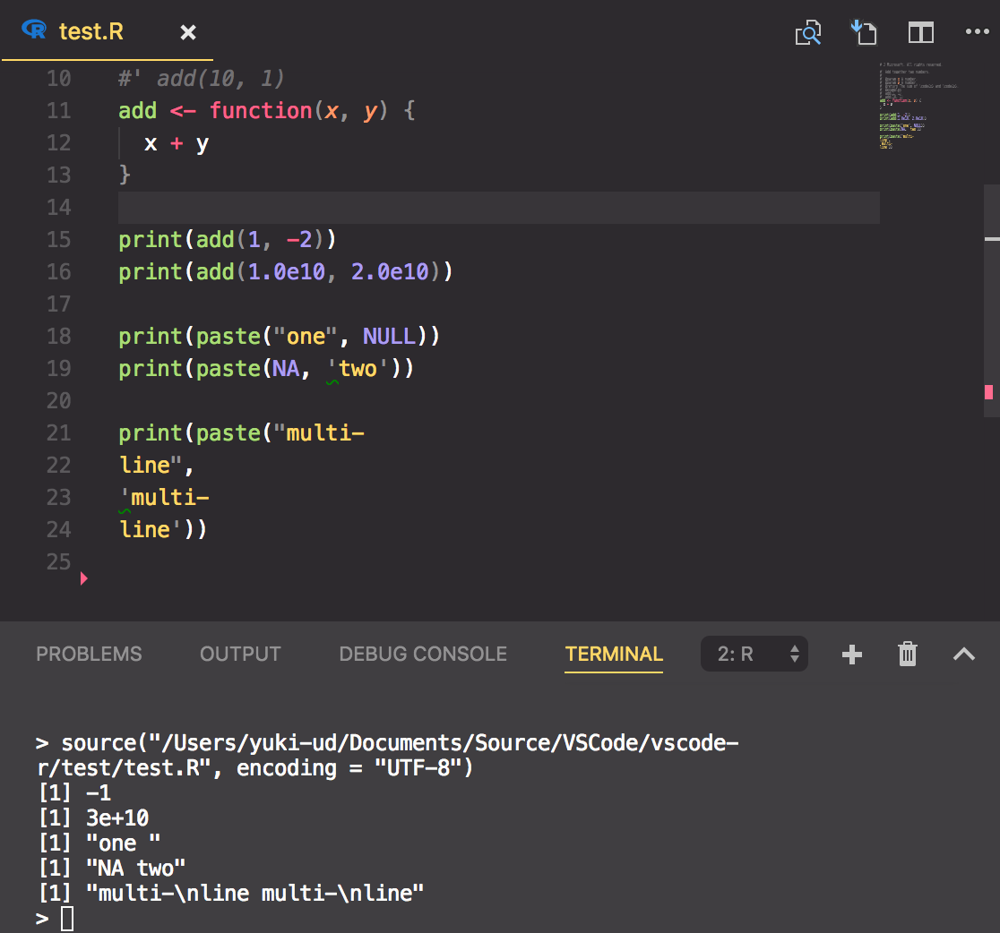
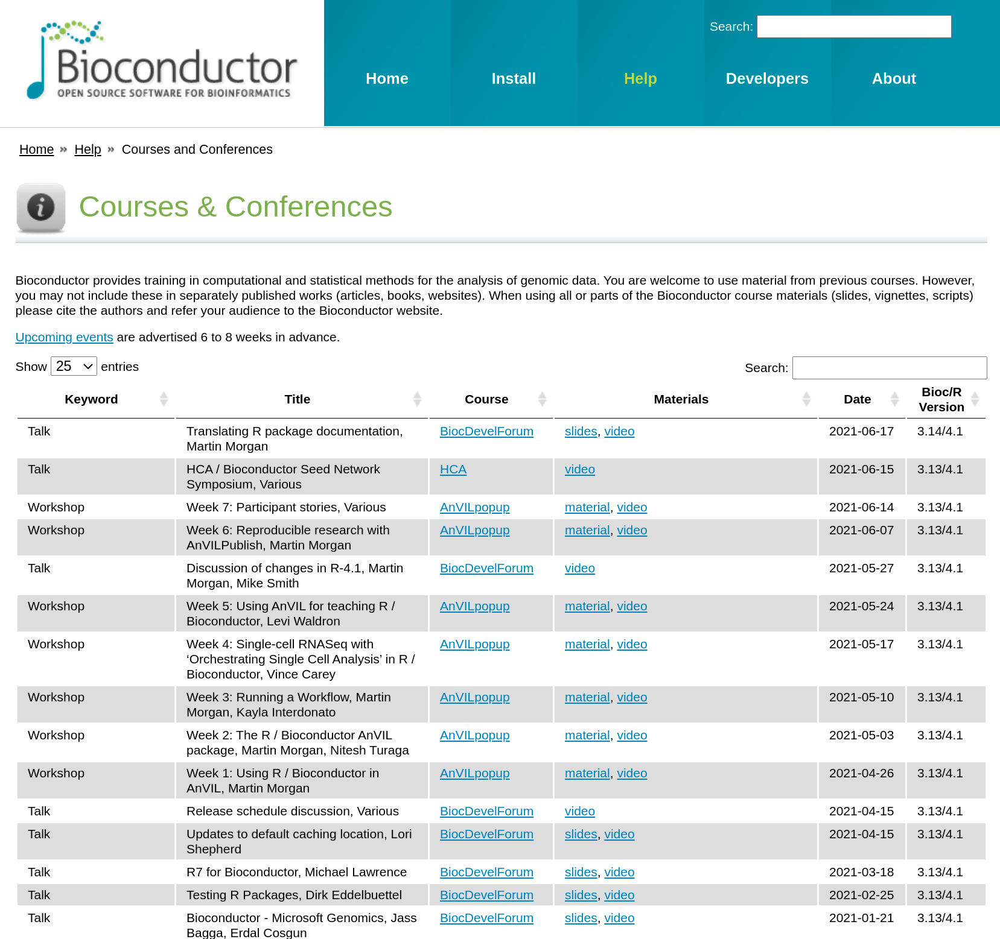
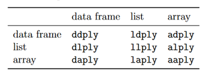

---------------------------------------

## Before this course

+ 歡迎任何問題，課程中有問題請隨時到[臉書](https://www.facebook.com/godkin1211/) 上問我。


---------------------------------------

## About R


>[R](http://www.r-project.org/about.html) is a **language** and **environment** for statistical computing and graphics. It is a GNU project which is similar to the S language and environment which was developed at Bell Laboratories (formerly AT&T, now Lucent Technologies) by John Chambers and colleagues. R can be considered as a different implementation of S. There are some important differences, but much code written for S runs unaltered under R.
......
>R is available as Free Software under the terms of the Free Software Foundation’s GNU General Public License in source code form. It compiles and runs on a wide variety of UNIX platforms and similar systems (including FreeBSD and Linux), Windows and MacOS.

#### R-4.5.1 was released since 2025 June.

---------------------------------------

## How/where to obtain and install R?

If you use linux as your default os, you can install R from the package repositories of each distribution directly. Alternatively, you can download R binary-version or source code from **CRAN** if you use M$ windows or Mac OS.

#### Ubuntu users
  + Update indices with `sudo apt update -qq`
  + Install two helper packages we need `sudo apt install --no-install-recommends software-properties-common dirmngr`
  + Add the signing key with `wget -qO- https://cloud.r-project.org/bin/linux/ubuntu/marutter_pubkey.asc | sudo tee -a /etc/apt/trusted.gpg.d/cran_ubuntu_key.asc`
  + Add the repo from CRAN with `sudo add-apt-repository "deb https://cloud.r-project.org/bin/linux/ubuntu $(lsb_release -cs)-cran40/"`
  + Install R with `sudo apt install --no-install-recommends r-base r-base-dev`
  
#### MacOS users

  + Intel x86-64: **R-4.5.1-x86_64.pkg**
  + Apple silicon arm64: **R-4.5.1-arm64.pkg**
    - To compile R packages which contain Fortran code, Xcode 16.2 and [**arm64**-version GNU Fortran14.2](https://mac.r-project.org/tools/) is required.
    - [XQuartz](https://www.xquartz.org/) >= 2.8.5 is required to use X11 (including `tcltk`).

#### Windows users
  + Download the latest version of R from [CRAN](https://cran.r-project.org/bin/windows/base/)
  + Install R with the downloaded installer
  + Install Rtools from [CRAN](https://cran.r-project.org/bin/windows/Rtools/)
    - Rtools is a collection of tools for building R packages on Windows. It includes a compiler, a set of libraries, and other tools that are needed to build R packages from source.
  + Add Rtools to your PATH environment variable
    - Open the Control Panel and go to System and Security > System > Advanced system settings > Environment Variables.
    - Under System variables, find the PATH variable and click Edit.
    - Add the path to the Rtools bin directory (e.g., `C:\Rtools\bin`) to the PATH variable.
    - Click OK to save the changes.

#### CRAN Repositories
* Mirrors in Taiwan
    + [NTU](http://cran.csie.ntu.edu.tw/)
    + [YZU](http://ftp.yzu.edu.tw/CRAN/)

---------------------------------------

## Using RStudio as your default R-programming IDE

#### About [RStudio](http://www.rstudio.com/)
> RStudio is an integrated development environment (IDE) for R. It includes a console, syntax-highlighting editor that supports direct code execution, as well as tools for plotting, history, debugging and workspace management. 

#### Install the most suitable version of RStudio for your needs.
  + Desktop version: Access RStudio locally.
  + Server version: Access via a web browser.
 
#### Other choices
  +  : [VS code](https://marketplace.visualstudio.com/items?itemName=Ikuyadeu.r)
  +  : [Vim+Nvim-R](https://github.com/jalvesaq/Nvim-R)
  + Any other text editors: gedit, emacs(+ESS), eclipse and etc. 
  
---------------------------------------

## Resources of learning R
#### 1. Books & web sites
  + [Computational Genomics with R](https://compgenomr.github.io/book/)
  + ~~[Introduction to Probability and Statistics Using R](http://ipsur.org/)~~
  + ~~[Introduction to Scientific Programming and Simulation Using R](http://www.amazon.com/Introduction-Scientific-Programming-Simulation-Chapman/dp/1420068725)~~
  + ~~[The Art of R Programming](http://www.amazon.com/The-Art-Programming-Statistical-Software/dp/1593273843)~~
  + ~~[R Tutorial](http://www.cyclismo.org/tutorial/R/)~~
  + ~~[Programming in R](http://manuals.bioinformatics.ucr.edu/home/programming-in-r)~~
  + [Advanced R](http://adv-r.had.co.nz/)
  + ~~[Bioconductor Course Materials](https://bioconductor.org/help/course-materials/)~~

#### ~~2. Forums & communities~~
  + [R-bloggers](http://www.r-bloggers.com/)
  + ~~[Taiwan R User Group](http://www.meetup.com/Taiwan-R)~~
  + ~~[Stack Overflow](http://stackoverflow.com/questions/tagged/r)~~
  + ~~[Ptt R_Language](https://www.ptt.cc/bbs/R_Language/index.html)~~
  + [Taipei Bioinformatics Omnibus](https://www.facebook.com/groups/446434039038963)
  + ~~[Right Relevance](https://www.rightrelevance.com/)~~
  
#### ~~3. Blog & News~~
  + ~~[R Weekly](https://rweekly.org)~~
  + ~~[R语言中文社区](https://466874.kuaizhan.com/)~~
  + ~~[糗世界](http://216.49.144.90:8080/rbioconductor-2)~~
  + ~~[R的極客理想](http://blog.fens.me/series-r/)~~
  
#### LLM-based tools
  + [Claude](https://claude.ai/)
  + [Claude Code](https://www.anthropic.com/claude-code)
  

---------------------------------------

## The most important step when beginning to learn R is using help()

#### help() & help.search()

```{r help, eval=FALSE, echo=TRUE}
help(help)
help.search("standard deviation")
```

#### ? & ??

```{r question, eval=FALSE, echo=TRUE}
?mean
??hypergeometric
```
---------------------------------------

## Package installation & PATH setting

#### Installing packages in R console

```{r install Pkgs, eval=FALSE}
# Download Pkgs from CRAN repository & install
install.packages('rmarkdown',                        # Package name
                 repo="http://cran.csie.ntu.edu.tw", # The URL of CRAN repository
                 destdir="~/Download",               # The directory where downloaded pkgs are stored
                 lib=.libPaths()[1])                 # The directory where to install pkgs

# Install Pkgs from downloaded source code
install.packages('~/Download/rmarkdown_0.5.1.tar.gz',
                 repos=NULL,
                 type="source",
                 lib=.libPaths()[1])
```

#### Installing packages in terminal

```{r shell, eval=FALSE}
$ R CMD INSTALL -l $HOME/R/4.1 rmarkdown_0.5.1.tar.gz
```

#### Setting PATH

```{r setting PATH, eval=FALSE}
.libPaths(new)  # .libPaths("/Library/Frameworks/R.framework/Versions/4.5-arm64/Resources/library")
```

#### Some Pkgs should be downloaded/installed from [R-forge](https://r-forge.r-project.org/)

Set `install.packages(Pkg, repo='http://R-Forge.R-project.org')`

#### Using the package installed

```{r recruit Pkgs, eval=FALSE}
library(Pkg)
require(Pkg) # Avoid to use this!
```
**[What is the difference between require() and library()](http://stackoverflow.com/questions/5595512/what-is-the-difference-between-require-and-library)**

---------------------------------------

## Bioconductor
#### About [Bioconductor](http://www.bioconductor.org/)

> Bioconductor provides tools for the analysis and comprehension of high-throughput genomic data. Bioconductor uses the R statistical programming language, and is open source and open development.

#### Install Pkgs from Bioconductor

```{r Bioconductor, eval=FALSE}
# Install BiocManager
install.packages("BiocManager")
BiocManager::install(pkgname)
```

#### Rich course materials

[Courses & conference](https://www.bioconductor.org/help/course-materials/)



---------------------------------------

## Basic operation

```{r basic operation, eval=FALSE}
5+5
5-3
5*3
5/3
5^3
10%%3

# Variable declaration
x <- 5 # '<-' is assign operator in R, which is equivalent to '='
y <- function(i) mean(i)
```

---------------------------------------

## Data and object types

#### Data types
  + numeric: `c(1:3, 5 ,7)`
  + character: `c("1","2","3"); LETTERS[1:3]`
  + logical: `TRUE; FALSE`
  + complex: 1, b, 3

#### Object types
  + **vector**: the data types of all elements in a vector must be consistent!
```{r vector}
x <- 1:5
y <- c(6,7,8,9,10)
z <- x - y
print(z)
```
```{r}
# Vectorized code performs better!
a <- 1:100000
system.time(mean(a))
total <- 0
system.time(for (i in a) {total <- total + i; total/100000})
```

  + **matrix** 
```{r matrix}
x <- matrix(rnorm(100), nr=20, nc=5)
print(x)
```
```{r matrix operation, eval=FALSE}
x[1,3]
x[2:4,]
x[,3:5]
x %*% t(x)

# A matrix is a vector with subscripts!
x[1:3]
x[1:3,1]
```

  + **array**
```{r array}
y <- array(rnorm(64), c(8,4,2))
print(y) # An array is also a vector with subscripts!
```

  + **list**: the data types of elements in a list could be complex
```{r list}
x<-list(1:5, c("a","b","c"), matrix(rnorm(10),nr=5,nc=2))
print(x)
x$mylist <- x
print(x)
```

  + **data frame**: a data frame is collection of multiple lists with the same length 
```{r data.frame}
df<-data.frame(num=1:10, 
           char=LETTERS[1:10], 
           logic=sample(c(TRUE,FALSE), 10, replace=TRUE))

df
df$char
df$logic[5:7]
```


  + **factor**: An R **factor** might be viewed simply as **a vector with a bit more information added** (though, as seen below, it’s different from this internally). That extra information consists of a record of the distinct values in that vector, called **levels**.
  
```{r factor}
x <- c(5, 12, 32, 12)
xf <- factor(x)
print(xf)
```
So.... a factor looks like a vector, right?

```{r}
str(xf) # Here str stands for structure. This function shows the internal structure of any R object.
unclass(xf)
length(xf)
```

What??? What are you talking about?

```{r}
x <- c(5, 12, 13, 12)
xff <- factor(x, levels=c(5, 12, 13, 88))
xff
xff[2] <- 88 
xff
xff[2] <- 28 # You cannot sneak in an "illegal" level
```

  + **table**: Another common way to store information is in a table.
```{r table}
# One way table
a <- factor(c("A","A","B","A","B","B","C","A","C"))
a
a.table <- table(a)
a.table
attributes(a.table)

# Two way table
a <- c("Sometimes","Sometimes","Never","Always","Always","Sometimes","Sometimes","Never")
b <- c("Maybe","Maybe","Yes","Maybe","Maybe","No","Yes","No")
twoway.table <- table(a,b)
twoway.table

# An example
sexsmoke<-matrix(c(70,120,65,140),ncol=2,byrow=TRUE)
rownames(sexsmoke)<-c("male","female")
colnames(sexsmoke)<-c("smoke","nosmoke")
sexsmoke <- as.table(sexsmoke)
sexsmoke
```

---------------------------------------

## Control structures

#### Conditional excutions
  + **equal**: ==
  + **not equal**: !=
  + **greater/less than**: >, <
  + **greater/less than or equal**: >=, <=
  

#### Logical operators
  + **and**: &, &&
  + **or**: |, ||
  + **not**: !
  
#### if-else statements
```{r if-else, eval=FALSE}
if (cond1==TRUE) {cmd1} else {cmd2}
```
```{r}
# Example
if (1 == 0) {
    print(1)
} else {
    print(2)
}
```

#### ifelse statements (ternary operator in R)
```{r ifelse, eval=FALSE}
ifelse(test, true_value, false_value)
```
```{r}
x <- 1:10
ifelse(x<5|x>8, x, 0)
```

#### switch-case statements
```{r switch}
AA <- 'foo'
switch(AA,
       foo = {print('AA is foo')},
       bar = {print('AA is bar')},
       {print('Default')}
)
```


---------------------------------------

## Loops

#### For loop
```{r for, eval=FALSE}
for (var in vector) {
    statement
}
```
```{r}
# Example
mydf <- iris
head(mydf)
myve <- NULL
for (i in 1:nrow(mydf)) {
    myve <- c(myve, mean(as.numeric(mydf[i, 1:3])))
}
myve
```

#### while loop
```{r while, eval=FALSE}
while (condition) statements
```
```{r}
# Example
z <- 0
while (z < 5) {
    z <- z + 2
    print(z)
}
```

#### apply loop

##### For matrix/array
```{r apply, eval=FALSE}
apply(X, MARGIN, FUN, ARGS)

# Examples
apply(iris[,1:3], 1, mean)

x <- 1:10

apply(as.matrix(x), 1, function(i) {
    if (i < 5) 
        i - 1 
    else 
        i/i
})
```

##### For vector/list
```{r lapply/sapply, eval=FALSE}
lapply(X, FUN)
sapply(X, FUN)
```
```{r}
# Examples
mylist <- as.list(iris[1:3, 1:3])
mylist
lapply(mylist, sum) # Compute sum of each list component and return result as list
sapply(mylist, sum) # Compute sum of each list component and return result as vector
```

##### More apply functions
  + **tapply**
  + **mapply**
  
---------------------------------------

## function
```{r function, eval=FALSE}
FunctionName <- function(arg1, arg2, ...) { 
    statements
    return(R_object)
}
```
```{r}
add <- function(a, b) {
    c <- a + b
    return(c)
}
x <- 5
y <- 7
z <- add(x,y)
z
```


---------------------------------------

## Advanced R programming

#### Garbage collection
  + **rm()**
  + **gc()**

```{r gc, eval=FALSE}
x <- as.matrix(read.table("test.csv", sep="\t")) # x is a 4500000 x 220 matrix
y <- apply(x, 1, mean)
rm(list=c("x","y"))
gc()
```

#### Use data.table to speed up acquisition of data

##### See [Introduction to the data.table package in R](http://cran.r-project.org/web/packages/data.table/vignettes/datatable-intro.pdf)

> Fast aggregation of large data (e.g. 100GB in RAM), fast ordered joins, fast add/modify/delete of columns by group using no copies at all, list columns and a fast file reader (fread). Offers a natural and flexible syntax, for faster development. - from [CRAN](http://cran.r-project.org/web/packages/data.table/index.html)

```{r data.table}
library(data.table)
grpsize <- ceiling(1e7/26^2)
DF <- data.frame(
    x=rep(LETTERS, each=26*grpsize),
    y=rep(letters, each=grpsize),
    v=runif(grpsize*26^2),
    stringsAsFactors=FALSE)
system.time(ans1 <- DF[DF$x=="R" & DF$y=="h",])

DT <- as.data.table(DF)
setkey(DT, x, y)
system.time(ans2 <- DT[list("R","h")])
```

#### Tidyverse

> The [tidyverse](https://www.tidyverse.org/) is an opinionated collection of R packages designed for data science. All packages share an underlying philosophy and common APIs. 


```{r, eval=FALSE}
install.packages("tidyverse")
```
+ magrittr
> A Forward-Pipe Operator for R

Use this equation as an example:

$$
\LARGE
\boldsymbol{log(\sum_{i=1}^{n}exp(x_i))}
$$

In R, you may want to calculate the equation with many functions like this:

```{r, eval=FALSE, echo=TRUE}
log(sum(exp(MyData)), exp(1))
```

With `magrittr`, you can calculate the equation like this:

```{r, eval=FALSE, echo=TRUE}
MyData %>% exp %>% sum %>% log(exp(1))
```

+ plyr

> “
plyr is a set of tools that solves a common set of problems:  you need to break a big problem down into manageable pieces, operate on each pieces and then put all the pieces back together.  It’s already possible to do this with split and the apply functions, but plyr just makes it all a bit easier. . . ”



```{r, eval=TRUE, echo=TRUE}
set.seed(1)
d <- data.frame(year = rep(2000:2005, each=3),
                count = round(runif(runif(18, 0, 20)))
                )

print(d)

library(plyr)
ddply(d, "year", function(x) {
    mean.count <- mean(x$count)
    sd.count <- sd(x$count)
    cv <- sd.count/mean.count
    data.frame(cv.count=cv)
})
```

+ dplyr
  > dplyr is a package for data manipulation, written and maintained by Hadley Wickham. It provides some great, easy-to-use functions that are very handy when performing exploratory data analysis and manipulation. 

  - `filter()`: the function will return all the rows that satisfy a following condition. 
  
```{r, echo=TRUE, eval=TRUE}
library(dplyr)

# Let's start with a dataset about air quality
head(airquality)

# Filter the records with Temp <= 70
filter(airquality, Temp > 70)

# Select the records with Temp > 80 & Month is after May
filter(airquality, Temp > 80 & Month > 5)
```

  - `mutate()`: the function is used to add new variables to the data. 
  
```{r, echo=TRUE, eval=TRUE}
mutate(airquality, TempInC = (Temp - 32) * 5 / 9)
```

  - `summarise()`: the function is used to summarise multiple values into a single value.

```{r, echo=TRUE, eval=TRUE}
summarise(airquality, mean(Temp, na.rm = TRUE))
```

  - `group_by()`: the function is used to group data by one or more variables. 

```{r, echo=TRUE, eval=TRUE}
summarise(group_by(airquality, Month), mean(Temp, na.rm = TRUE))
```

  - `sample_n()` and `sample_frac()`: these two functions are used to select random rows from a table.
  
```{r, echo=TRUE, eval=TRUE}
sample_n(airquality, size = 10)
sample_frac(airquality, size = 0.1)
```

  - `count()`: the function tallies observations based on a group.
  
```{r, echo=TRUE, eval=TRUE}
count(airquality, Month)
```

  - `arrange()`: the function is used to arrange rows by variables. 
 
```{r, eval=TRUE, echo=TRUE}
arrange(airquality, desc(Month), Day)
```

Now, let's put those commands together!

```{r, echo=TRUE, eval=TRUE}
airquality %>% 
    filter(Temp > 70 & Month != 5) %>% 
    group_by(Month) %>% 
    summarise(mean(Temp, na.rm = TRUE))
```

+ tidyr
  > tidyr is new package that makes it easy to “tidy” your data. Tidy data is data that’s easy to work with: it’s easy to munge (with dplyr), visualise (with ggplot2 or ggvis) and model (with R’s hundreds of modelling packages). 
  
    * gather(data, key, value, ..., na.rm = FALSE, convert = FALSE)

```{r, echo=TRUE, eval=TRUE}
library(tidyr)
head(mtcars)
mtcars$car <- rownames(mtcars)
mtcars <- mtcars[, c(12, 1:11)]
head(mtcars)
mtcarNew <- mtcars %>% gather(attribute, value, -car)
head(mtcarNew)
tail(mtcarNew)
```  

    * spread(data, key, value, fill = NA, convert = FALSE, drop = TRUE)
  
```{r, echo=TRUE, eval=TRUE}
mtcarSpread <- mtcarNew %>% spread(attribute, value)
head(mtcarSpread)
```

    * unite(data, col, ..., sep = "_", remove = TRUE)
    
```{r, echo=TRUE, eval=TRUE}
set.seed(1)
date <- as.Date('2016-01-01') + 0:14
hour <- sample(1:24, 15)
min <- sample(1:60, 15)
second <- sample(1:60, 15)
event <- sample(letters, 15)
data <- data.frame(date, hour, min, second, event)
data
dataNew <- data %>%
  unite(datehour, date, hour, sep = ' ') %>%
  unite(datetime, datehour, min, second, sep = ':')
dataNew
```

    * separate(data, col, into, sep = "[^[:alnum:]]+", remove = TRUE, convert = FALSE, extra = "warn", fill = "warn", ...)

```{r, echo=TRUE, eval=TRUE}
data1 <- dataNew %>% 
  separate(datetime, c('date', 'time'), sep = ' ') %>% 
  separate(time, c('hour', 'min', 'second'), sep = ':')
data1
```

+ purrr

  > purrr enhances R's functional programming (FP) toolkit by providing a complete and consistent set of tools for working with functions and vectors. If you've never heard of FP before, the best place to start is the family of map() functions which allow you to replace many for loops with code that is both more succinct and easier to read. The best place to learn about the `map()` functions is the iteration chapter in R for data science.

```{r, eval=TRUE, echo=TRUE}
library(purrr)

mtcars %>%
  split(.$cyl) %>% # from base R
  map(~ lm(mpg ~ wt, data = .)) %>%
  map(summary) %>%
  map_dbl("r.squared")
```

+ stringr

  > stringr is built on top of stringi, which uses the ICU C library to provide fast, correct implementations of common string manipulations. stringr focusses on the most important and commonly used string manipulation functions whereas stringi provides a comprehensive set covering almost anything you can imagine. 
  
```{r, echo=TRUE, eval=TRUE}
library(stringr)

x <- c("why", "video", "cross", "extra", "deal", "authority")
str_length(x) 
str_c(x, collapse = ", ")
str_sub(x, 1, 2)
str_dup(x, 2:7)

str_subset(x, "[aeiou]")
str_count(x, "[aeiou]")

str_detect(x, "[aeiou]")
str_subset(x, "[aeiou]")
str_locate(x, "[aeiou]")
str_extract(x, "[aeiou]")
str_match(x, "(.)[aeiou](.)")
str_replace(x, "[aeiou]", "?")

str_split(c("a,b", "c,d,e"), ",")
```


---

## What's new in R 4.1.0?

#### 1. New __pipe operator__: `|>`

```{r pipe_operator_1, echo = TRUE, eval = TRUE}
rnorm(100, mean = 4, sd = 1) |>
  density() |>
  plot()
```

```{r pipe_operator_2, echo = TRUE, eval = TRUE}
c("Homo sapiens", "Mus musculus", "Rattus norvegicus") |> {function(i) grepl("homo", i, ignore.case = TRUE)}()
```

#### 2. Simplified function statement with `\`

+ How did we write a self-defined function in `map()` function before R 4.1.0?

```{r map_function_before, echo = TRUE, eval = FALSE}
map(
  letters[2:3],
  function(x) {
    pattern <- paste0("^", x)
    grep(pattern, ls("package:datasets"), value = TRUE, ignore.case = TRUE)
  }
)
```

+ Since R 4.1.0, we can write it again in this style:

```{r map_function_now, echo = TRUE, eval = TRUE}
map(
  letters[2:3],
  \(x){
    pattern <- paste0("^", x)
    grep(pattern, ls("package:datasets"), value = TRUE, ignore.case = TRUE)
  }
)
```

---

## Updates in R 4.2.0

+ Use **pipe operator** more elegantly with the underscore placeholder **_**
  - In R 4.1
```{r r41, echo = TRUE, eval = FALSE}
mtcars |> (\(x) lm(hp ~ cyl, data = x))()
```

  - In R 4.2
```{r r42, echo = TRUE, eval = FALSE}
mtcars |> lm(hp ~ cyl, data = _)
```

---------------------------------------

## Drawing graph

#### [ggplot2](http://ggplot2.org/) - The Art of Grammar of Graphics

> ggplot2 is an R plotting system based on the **Grammar of Graphics**, which takes the good parts of base R and lattice graphics systems while eliminating the bad parts. It not only handles tedious plotting details (such as legend creation) but also provides a powerful graphics model that makes creating complex multi-layered graphics simple.

##### In-depth Analysis of Grammar of Graphics Core Philosophy

**Why Do We Need a Grammar of Graphics?**

In traditional graphics systems, we are usually limited to predefined chart types (scatter plots, bar charts, line plots, etc.). This is like being able to say only fixed sentences without being able to combine vocabulary to express new ideas.

```{r grammar_philosophy, eval=FALSE}
# Traditional thinking: Choose fixed chart types
plot(x = mtcars$wt, y = mtcars$mpg)  # Scatter plot
barplot(table(mtcars$cyl))           # Bar chart

# Grammar of Graphics thinking: Combine grammar elements
ggplot(mtcars, aes(x = wt, y = mpg)) +     # Data + aesthetic mapping
  geom_point() +                           # Geometric object
  stat_smooth(method = "lm") +             # Statistical transformation
  facet_wrap(~ cyl) +                      # Faceting
  theme_minimal()                          # Theme
```

**Seven Core Components of Grammar of Graphics**

> *"By understanding the grammar and how its components fit together, you can create a wider range of visualizations"* - Hadley Wickham

1. **Data**: The dataset to be visualized
2. **Aesthetic Mappings**: How variables map to visual properties
3. **Layers**: Composed of geometric objects and statistical transformations
4. **Scales**: Control mapping from data values to aesthetic attributes
5. **Coordinate System**: Define how data coordinates are displayed
6. **Facets**: Split data into multiple subplots
7. **Themes**: Control the overall visual appearance of the plot

##### Component 1: Data - The Foundation of Everything

```{r data_foundation, echo=TRUE, eval=TRUE}
library(ggplot2)
library(dplyr)

# Explore our data
head(mtcars)
str(mtcars)

# ggplot2's first principle: Tidy Data
# Each row is an observation, each column is a variable
```

##### Component 2: Aesthetic Mappings - Bridge Between Data and Visuals

Aesthetic mappings define how data variables correspond to visual properties. This is the core concept of Grammar of Graphics.

```{r aesthetic_deep_dive, echo=TRUE, eval=TRUE}
# Basic aesthetic mapping
p_base <- ggplot(mtcars, aes(x = wt, y = mpg))

# Global aesthetic mapping vs local aesthetic mapping
ggplot(mtcars, aes(x = wt, y = mpg, color = factor(cyl))) +  # Global
  geom_point() +
  geom_smooth(aes(color = NULL), method = "lm", color = "black")  # Local override

# Types of aesthetic mappings
ggplot(mtcars, aes(x = wt, y = mpg)) +
  geom_point(aes(
    color = hp,        # Continuous variable mapped to color
    size = qsec,       # Continuous variable mapped to size
    shape = factor(am), # Categorical variable mapped to shape
    alpha = vs         # Continuous variable mapped to transparency
  ))
```

**Aesthetic Mapping vs Setting Fixed Aesthetic Properties**

```{r aesthetic_vs_setting, echo=TRUE, eval=TRUE}
# Mapping (inside aes()) vs Setting (outside aes())
p1 <- ggplot(mtcars, aes(x = wt, y = mpg)) +
  geom_point(aes(color = factor(cyl))) +  # Mapping: color corresponds to data
  labs(title = "Mapping: Color by Cylinder Count")

p2 <- ggplot(mtcars, aes(x = wt, y = mpg)) +
  geom_point(color = "red") +  # Setting: all points are red
  labs(title = "Setting: All Points Are Red")

# Display the difference
library(patchwork)
p1 / p2
```

##### Component 3: Layers - Building Blocks for Complex Graphics

In Grammar of Graphics, each layer contains five components:

1. **Data**: Layer-specific data
2. **Aesthetic mappings**: Mapping from variables to visual properties
3. **Geom**: Type of geometric object
4. **Stat**: Statistical transformation
5. **Position**: Position adjustment

```{r layers_anatomy, echo=TRUE, eval=TRUE}
# Understanding layer structure
ggplot(mtcars, aes(x = factor(cyl), y = mpg)) +
  # Layer 1: Raw data points
  geom_point(aes(color = "Raw Data"), position = position_jitter(width = 0.2)) +
  # Layer 2: Statistical summary (mean)
  stat_summary(fun = mean, geom = "point", 
               aes(color = "Mean"), size = 4, shape = 17) +
  # Layer 3: Error bars
  stat_summary(fun.data = mean_se, geom = "errorbar", 
               aes(color = "Std Error"), width = 0.2) +
  # Layer 4: Trend line
  geom_smooth(aes(group = 1, color = "Trend Line"), method = "lm", se = FALSE) +
  scale_color_manual(values = c("Raw Data" = "gray60", 
                               "Mean" = "red", 
                               "Std Error" = "blue",
                               "Trend Line" = "darkgreen")) +
  labs(title = "Multi-layer Display: Engine Cylinders vs Fuel Efficiency",
       x = "Cylinders", y = "Miles Per Gallon", color = "Layer Type")
```

**Relationship Between Geom and Stat**

```{r geom_stat_relationship, echo=TRUE, eval=TRUE}
# Every geom has a corresponding default stat
# geom_bar()'s default stat is "count"
p1 <- ggplot(mtcars, aes(x = factor(cyl))) +
  geom_bar() +
  labs(title = "geom_bar() + stat_count()")

# stat_count()'s default geom is "bar"
p2 <- ggplot(mtcars, aes(x = factor(cyl))) +
  stat_count() +
  labs(title = "stat_count() + geom_bar()")

# Change default behavior
p3 <- ggplot(mtcars, aes(x = factor(cyl))) +
  geom_bar(stat = "count") +  # Explicitly specify
  labs(title = "Explicitly Specify Stat")

p4 <- ggplot(mtcars, aes(x = factor(cyl))) +
  stat_count(geom = "point", size = 4) +  # Change geom
  labs(title = "Display Count with Points")

(p1 | p2) / (p3 | p4)
```

##### Component 4: Scales - Bridge from Data Space to Visual Space

Scales control how data values are mapped to visual properties. Each aesthetic mapping requires a corresponding scale.

```{r scales_deep_dive, echo=TRUE, eval=TRUE}
# Understanding scale function
# Continuous scales
ggplot(mtcars, aes(x = wt, y = mpg, color = hp)) +
  geom_point(size = 3) +
  scale_color_gradient(name = "Horsepower",
                      low = "blue", high = "red",
                      breaks = c(100, 200, 300),
                      labels = c("Low", "Medium", "High")) +
  labs(title = "Continuous Scale: Horsepower Color Mapping")

# Discrete scales
ggplot(mtcars, aes(x = wt, y = mpg, color = factor(cyl))) +
  geom_point(size = 3) +
  scale_color_manual(name = "Cylinders",
                    values = c("4" = "#E69F00", "6" = "#56B4E9", "8" = "#CC79A7"),
                    labels = c("Four", "Six", "Eight")) +
  labs(title = "Discrete Scale: Cylinder Color Mapping")
```

**Scale Transformations and Coordinate Systems**

```{r scale_transformations, echo=TRUE, eval=TRUE}
# Logarithmic transformation
library(scales)
ggplot(mtcars, aes(x = wt, y = mpg)) +
  geom_point() +
  scale_x_log10(name = "Weight (Log Scale)", 
                labels = label_comma()) +
  scale_y_log10(name = "MPG (Log Scale)",
                labels = label_comma()) +
  labs(title = "Logarithmic Scale Transformation")

# Custom breaks and labels
ggplot(mtcars, aes(x = hp, y = mpg)) +
  geom_point() +
  scale_x_continuous(name = "Horsepower",
                    breaks = seq(50, 350, by = 50),
                    labels = paste0(seq(50, 350, by = 50), "HP")) +
  scale_y_continuous(name = "Fuel Efficiency",
                    breaks = seq(10, 35, by = 5),
                    labels = paste0(seq(10, 35, by = 5), "mpg")) +
  labs(title = "Custom Axis Labels and Breaks")
```

##### Component 5: Coordinate Systems - The Art of Positioning

Coordinate systems determine how position aesthetic attributes are mapped to the actual positions in the graphic.

```{r coordinate_systems, echo=TRUE, eval=TRUE}
# Cartesian coordinate system (default)
p1 <- ggplot(mtcars, aes(x = factor(cyl), y = mpg)) +
  geom_boxplot() +
  labs(title = "Cartesian Coordinate System")

# Flipped coordinate system
p2 <- ggplot(mtcars, aes(x = factor(cyl), y = mpg)) +
  geom_boxplot() +
  coord_flip() +
  labs(title = "Flipped Coordinate System")

# Polar coordinate system
p3 <- ggplot(mtcars, aes(x = factor(cyl), fill = factor(cyl))) +
  geom_bar() +
  coord_polar(theta = "x") +
  labs(title = "Polar Coordinate System - Pie Chart")

# Fixed ratio coordinate system
p4 <- ggplot(mtcars, aes(x = wt, y = mpg)) +
  geom_point() +
  coord_fixed(ratio = 1) +
  labs(title = "Fixed Ratio Coordinate System")

(p1 | p2) / (p3 | p4)
```

##### Component 6: Facets - The Power of Small Multiples

Faceting allows splitting data into subsets, with each subset displayed in a separate panel.

```{r faceting_mastery, echo=TRUE, eval=TRUE}
# facet_wrap: one-dimensional faceting
p1 <- ggplot(mtcars, aes(x = wt, y = mpg)) +
  geom_point() +
  geom_smooth(method = "lm", se = FALSE) +
  facet_wrap(~ cyl, nrow = 2, 
             labeller = labeller(cyl = function(x) paste(x, "Cylinders"))) +
  labs(title = "facet_wrap: Faceted by Cylinder Count")

# facet_grid: two-dimensional faceting
p2 <- ggplot(mtcars, aes(x = wt, y = mpg)) +
  geom_point() +
  facet_grid(am ~ cyl, 
             labeller = labeller(am = c("0" = "Automatic", "1" = "Manual"),
                                cyl = function(x) paste(x, "Cyl"))) +
  labs(title = "facet_grid: Transmission Type × Cylinder Count")

p1 / p2
```

**Advanced Faceting Usage**

```{r advanced_faceting, echo=TRUE, eval=TRUE}
# Free scales
ggplot(mtcars, aes(x = disp, y = mpg)) +
  geom_point() +
  geom_smooth(method = "lm", se = FALSE) +
  facet_wrap(~ cyl, scales = "free", 
             labeller = labeller(cyl = function(x) paste("Cylinders:", x))) +
  labs(title = "Free Scale Faceting: Each Panel Has Independent Axis Ranges",
       x = "Displacement", y = "Fuel Efficiency")
```

##### Component 7: Themes - The Final Mile of Visual Aesthetics

Themes control the non-data elements of the plot, such as fonts, colors, and lines.

```{r themes_showcase, echo=TRUE, eval=TRUE}
# Base plot
base_plot <- ggplot(mtcars, aes(x = wt, y = mpg, color = factor(cyl))) +
  geom_point(size = 3) +
  geom_smooth(method = "lm", se = FALSE) +
  labs(title = "Different Theme Showcase",
       subtitle = "Same Data, Different Feel",
       x = "Weight (1000 lbs)", 
       y = "Fuel Efficiency (mpg)",
       color = "Cylinders")

# Built-in theme comparison
p1 <- base_plot + theme_gray() + labs(title = "theme_gray (default)")
p2 <- base_plot + theme_minimal() + labs(title = "theme_minimal")
p3 <- base_plot + theme_classic() + labs(title = "theme_classic")
p4 <- base_plot + theme_void() + labs(title = "theme_void")

(p1 | p2) / (p3 | p4)
```

**Custom Themes**

```{r custom_theme, echo=TRUE, eval=TRUE}
# Create custom theme
my_theme <- theme_minimal() +
  theme(
    # Title settings
    plot.title = element_text(size = 16, face = "bold", hjust = 0.5),
    plot.subtitle = element_text(size = 12, hjust = 0.5, color = "gray50"),
    # Axis settings
    axis.title = element_text(size = 12, face = "bold"),
    axis.text = element_text(size = 10),
    # Legend settings
    legend.title = element_text(size = 12, face = "bold"),
    legend.text = element_text(size = 10),
    legend.position = "bottom",
    # Panel settings
    panel.grid.minor = element_blank(),
    panel.grid.major = element_line(color = "gray90", size = 0.5),
    # Background settings
    plot.background = element_rect(fill = "white", color = NA),
    panel.background = element_rect(fill = "gray98", color = NA)
  )

# Apply custom theme
ggplot(mtcars, aes(x = wt, y = mpg, color = factor(cyl))) +
  geom_point(size = 3, alpha = 0.8) +
  geom_smooth(method = "lm", se = TRUE, alpha = 0.3) +
  scale_color_viridis_d(name = "Cylinders") +
  labs(title = "Custom Theme Showcase",
       subtitle = "Professional-Grade Visualization Design",
       x = "Weight (1000 lbs)", 
       y = "Fuel Efficiency (mpg)") +
  my_theme
```

##### Grammar of Graphics Practical Case: Layer-by-Layer Construction

Let's demonstrate how to use Grammar of Graphics thinking to construct complex visualizations through a complete example.

```{r grammar_masterpiece, echo=TRUE, eval=TRUE}
# Step 1: Basic data layer
p <- ggplot(mtcars, aes(x = wt, y = mpg))

# Step 2: Add geometric objects
p <- p + geom_point(aes(color = factor(cyl), size = hp), alpha = 0.7)

# Step 3: Add statistical transformation
p <- p + geom_smooth(method = "lm", se = TRUE, color = "black", linetype = "dashed")

# Step 4: Customize scales
p <- p + 
  scale_color_manual(name = "Cylinders",
                    values = c("4" = "#E69F00", "6" = "#56B4E9", "8" = "#CC79A7")) +
  scale_size_continuous(name = "Horsepower", range = c(2, 8), 
                       breaks = c(100, 200, 300),
                       labels = c("100HP", "200HP", "300HP"))

# Step 5: Faceting
p <- p + facet_wrap(~ am, labeller = labeller(am = c("0" = "Automatic", "1" = "Manual")))

# Step 6: Add labels
p <- p + labs(
  title = "Grammar of Graphics in Practice: Car Performance Analysis",
  subtitle = "Exploring Relationships Between Weight, Fuel Efficiency, Power, and Transmission",
  x = "Weight (1000 lbs)",
  y = "Fuel Efficiency (mpg)",
  caption = "Data Source: mtcars dataset"
)

# Step 7: Apply theme
p <- p + theme_minimal() +
  theme(
    plot.title = element_text(size = 14, face = "bold", hjust = 0.5),
    plot.subtitle = element_text(size = 11, hjust = 0.5, color = "gray50"),
    strip.text = element_text(size = 11, face = "bold"),
    legend.position = "bottom"
  )

print(p)
```

##### Advanced Grammar Concepts: Position Adjustments

Position adjustments solve the problem of overlapping geometric objects and are an important concept in Grammar of Graphics.

```{r position_adjustments, echo=TRUE, eval=TRUE}
# Prepare data
df <- data.frame(
  category = rep(c("A", "B", "C"), each = 100),
  value = c(rnorm(100, 5, 1), rnorm(100, 7, 1.5), rnorm(100, 6, 2)),
  group = rep(c("Group1", "Group2"), 150)
)

# Different position adjustments
p1 <- ggplot(df, aes(x = category, y = value, fill = group)) +
  geom_col(position = "stack") +
  labs(title = "position = 'stack'")

p2 <- ggplot(df, aes(x = category, y = value, fill = group)) +
  geom_col(position = "dodge") +
  labs(title = "position = 'dodge'")

p3 <- ggplot(df, aes(x = category, y = value, fill = group)) +
  geom_col(position = "fill") +
  labs(title = "position = 'fill'")

p4 <- ggplot(mtcars, aes(x = factor(cyl), y = mpg)) +
  geom_point(position = position_jitter(width = 0.3, height = 0)) +
  labs(title = "position_jitter")

(p1 | p2) / (p3 | p4)
```

##### Complete Grammar of Graphics Workflow

```{r complete_workflow, echo=TRUE, eval=TRUE}
# Simulate a data science project visualization workflow
# 1. Data preparation
mtcars_extended <- mtcars %>%
  mutate(
    efficiency_category = case_when(
      mpg < 15 ~ "Low Efficiency",
      mpg < 25 ~ "Medium Efficiency", 
      TRUE ~ "High Efficiency"
    ),
    weight_category = case_when(
      wt < 2.5 ~ "Light",
      wt < 4 ~ "Medium",
      TRUE ~ "Heavy"
    )
  )

# 2. Exploratory visualization: Using Grammar of Graphics
final_plot <- ggplot(mtcars_extended, 
                    aes(x = wt, y = mpg)) +
  # Data layer 1: Background trend
  geom_smooth(method = "loess", se = TRUE, alpha = 0.2, color = "gray50") +
  # Data layer 2: Main data points
  geom_point(aes(color = efficiency_category, 
                size = hp,
                shape = factor(am)), 
            alpha = 0.8) +
  # Data layer 3: Category trend lines
  geom_smooth(aes(color = efficiency_category), 
             method = "lm", se = FALSE, size = 1.2) +
  # Scale settings
  scale_color_manual(name = "Efficiency Level",
                    values = c("Low Efficiency" = "#d73027", 
                             "Medium Efficiency" = "#fee08b", 
                             "High Efficiency" = "#1a9850")) +
  scale_size_continuous(name = "Horsepower", range = c(2, 8)) +
  scale_shape_manual(name = "Transmission",
                    values = c("0" = 16, "1" = 17),
                    labels = c("Automatic", "Manual")) +
  # Faceting
  facet_wrap(~ weight_category, scales = "free_x",
             labeller = labeller(weight_category = function(x) paste("Weight Category:", x))) +
  # Labels
  labs(
    title = "Comprehensive Car Performance Analysis",
    subtitle = "Using Grammar of Graphics to Explore Complex Relationships Between Weight, Fuel Efficiency, Power, and Transmission",
    x = "Vehicle Weight (1000 lbs)",
    y = "Fuel Efficiency (miles per gallon)",
    caption = "Data visualization demonstrates the combined power of Grammar of Graphics\nEach visual element carries specific information"
  ) +
  # Theme
  theme_minimal() +
  theme(
    plot.title = element_text(size = 16, face = "bold", hjust = 0.5),
    plot.subtitle = element_text(size = 12, hjust = 0.5, color = "gray40"),
    plot.caption = element_text(size = 9, color = "gray50", hjust = 1),
    strip.text = element_text(size = 11, face = "bold"),
    legend.position = "bottom",
    legend.box = "horizontal",
    panel.grid.minor = element_blank()
  ) +
  guides(
    color = guide_legend(override.aes = list(size = 4)),
    size = guide_legend(override.aes = list(alpha = 1)),
    shape = guide_legend(override.aes = list(size = 4))
  )

print(final_plot)
```

##### Grammar of Graphics Learning Key Points Summary

1. **Mindset Shift**: From "choosing chart types" to "combining grammar elements"
2. **Layering Concept**: Each layer has a clear purpose and function
3. **Mapping vs Setting**: Understanding when to use `aes()` and when not to
4. **Scale Importance**: Each aesthetic mapping requires a corresponding scale
5. **Iterative Improvement**: Grammar of Graphics supports gradual plot refinement

##### Basic Syntax Review and Hands-on Practice

After gaining a deep understanding of the theoretical foundation of Grammar of Graphics, let's review the basic syntax structure:

```{r basic_syntax_review, eval=FALSE}
# ggplot2 basic syntax structure
ggplot(data = <DATA>) +                    # 1. Specify data
  <GEOM_FUNCTION>(                         # 2. Choose geometric object
    mapping = aes(<MAPPINGS>),             # 3. Define aesthetic mapping
    stat = <STAT>,                         # 4. Statistical transformation (optional)
    position = <POSITION>                  # 5. Position adjustment (optional)
  ) +
  <SCALE_FUNCTION>() +                     # 6. Custom scales (optional)
  <COORDINATE_FUNCTION>() +                # 7. Coordinate system (optional)
  <FACET_FUNCTION>() +                     # 8. Faceting (optional)
  <THEME_FUNCTION>()                       # 9. Theme (optional)
```

**Quick Reference for Common Geometric Objects**


##### Hands-on Practice: From Basic to Advanced

**Practice 1: Progressive Construction of Scatter Plots**

Let's use Grammar of Graphics thinking to progressively build a scatter plot:

```{r practice_scatter_progression, echo=TRUE, eval=TRUE}
# Step 1: Only specify data and basic mapping
p1 <- ggplot(mtcars, aes(x = wt, y = mpg)) +
  geom_point() +
  labs(title = "Step 1: Basic Scatter Plot")

# Step 2: Add color mapping
p2 <- ggplot(mtcars, aes(x = wt, y = mpg)) +
  geom_point(aes(color = factor(cyl))) +
  labs(title = "Step 2: Add Color")

# Step 3: Add size mapping
p3 <- ggplot(mtcars, aes(x = wt, y = mpg)) +
  geom_point(aes(color = factor(cyl), size = hp)) +
  labs(title = "Step 3: Add Size")

# Step 4: Add shape and transparency
p4 <- ggplot(mtcars, aes(x = wt, y = mpg)) +
  geom_point(aes(color = factor(cyl), size = hp, shape = factor(am)), alpha = 0.7) +
  labs(title = "Step 4: Multiple Aesthetic Mappings")

(p1 | p2) / (p3 | p4)
```

**Practice 2: Applying Grammar Components**

```{r practice_grammar_components, echo=TRUE, eval=TRUE}
# Apply all the components we've learned
ggplot(mtcars, aes(x = wt, y = mpg)) +
  # Layer 1: Scatter plot
  geom_point(aes(color = factor(cyl), size = hp), alpha = 0.6) +
  # Layer 2: Trend line
  geom_smooth(method = "lm", se = TRUE, color = "black") +
  # Scale settings
  scale_color_brewer(name = "Cylinders", type = "qual", palette = "Set1") +
  scale_size_continuous(name = "Horsepower", range = c(2, 6)) +
  # Coordinate system
  coord_cartesian(xlim = c(1, 6), ylim = c(10, 35)) +
  # Labels
  labs(
    title = "Grammar of Graphics Practice",
    subtitle = "Composite Plot Integrating Multiple Components",
    x = "Weight (1000 lbs)",
    y = "Fuel Efficiency (mpg)",
    caption = "Demonstrates integration of data, aesthetic mappings, layers, scales, and coordinate systems"
  ) +
  # Theme
  theme_minimal() +
  theme(
    plot.title = element_text(hjust = 0.5, face = "bold"),
    plot.subtitle = element_text(hjust = 0.5),
    legend.position = "bottom"
  )
```

##### In-depth Exploration of Common Geometric Objects

After understanding the theoretical foundation of Grammar of Graphics, let's explore the practical applications of various geometric objects:

**Line Plots**

```{r ggplot_line, echo=TRUE, eval=TRUE}
# Line plot using economics dataset
ggplot(data = economics) + 
  geom_line(mapping = aes(x = date, y = unemploy))
```

###### Bar Charts

```{r ggplot_bar, echo=TRUE, eval=TRUE}
# Bar chart of car counts by cylinder
ggplot(data = mtcars) + 
  geom_bar(mapping = aes(x = factor(cyl), fill = factor(cyl)))
```

###### Histograms

```{r ggplot_histogram, echo=TRUE, eval=TRUE}
# Histogram of mpg distribution
ggplot(data = mtcars) + 
  geom_histogram(mapping = aes(x = mpg), bins = 10, fill = "skyblue", color = "black")
```

###### Box Plots

```{r ggplot_boxplot, echo=TRUE, eval=TRUE}
# Box plot of mpg by cylinder
ggplot(data = mtcars) + 
  geom_boxplot(mapping = aes(x = factor(cyl), y = mpg, fill = factor(cyl)))
```

##### Statistical Transformations

```{r ggplot_stat, echo=TRUE, eval=TRUE}
# Adding smooth trend line
ggplot(data = mtcars, aes(x = wt, y = mpg)) + 
  geom_point() + 
  geom_smooth(method = "lm", se = TRUE)
```

```{r ggplot_stat_summary, echo=TRUE, eval=TRUE}
# Statistical summary
ggplot(data = mtcars, aes(x = factor(cyl), y = mpg)) + 
  geom_point(position = "jitter", alpha = 0.6) +
  stat_summary(fun = mean, geom = "point", color = "red", size = 3) +
  stat_summary(fun.data = mean_se, geom = "errorbar", color = "red", width = 0.2)
```

##### Coordinate Systems and Scales

```{r ggplot_coords, echo=TRUE, eval=TRUE}
# Coordinate transformation
ggplot(data = mtcars, aes(x = wt, y = mpg)) + 
  geom_point() + 
  coord_flip()  # Flip x and y axes
```

```{r ggplot_scales, echo=TRUE, eval=TRUE}
# Custom scales
ggplot(data = mtcars, aes(x = wt, y = mpg, color = hp)) + 
  geom_point(size = 3) + 
  scale_color_gradient(low = "blue", high = "red") +
  scale_x_continuous(name = "Weight (1000 lbs)") +
  scale_y_continuous(name = "Miles per Gallon")
```

##### Faceting (Multiple Panels)

```{r ggplot_facet_wrap, echo=TRUE, eval=TRUE}
# Facet wrap
ggplot(data = mtcars, aes(x = wt, y = mpg)) + 
  geom_point() + 
  facet_wrap(~ cyl, nrow = 2)
```

```{r ggplot_facet_grid, echo=TRUE, eval=TRUE}
# Facet grid
ggplot(data = mtcars, aes(x = wt, y = mpg)) + 
  geom_point() + 
  facet_grid(am ~ cyl, labeller = label_both)
```

##### Customizing Themes and Appearance

```{r ggplot_theme_basic, echo=TRUE, eval=TRUE}
# Using built-in themes
ggplot(data = mtcars, aes(x = wt, y = mpg, color = factor(cyl))) + 
  geom_point(size = 3) + 
  theme_minimal()
```

```{r ggplot_theme_custom, echo=TRUE, eval=TRUE}
# Custom theme modifications
ggplot(data = mtcars, aes(x = wt, y = mpg, color = factor(cyl))) + 
  geom_point(size = 3) + 
  labs(title = "Car Weight vs Fuel Efficiency",
       subtitle = "Relationship between weight and MPG by cylinder count",
       x = "Weight (1000 lbs)",
       y = "Miles per Gallon",
       color = "Cylinders",
       caption = "Data source: mtcars dataset") +
  theme_classic() +
  theme(
    plot.title = element_text(size = 16, face = "bold"),
    plot.subtitle = element_text(size = 12, color = "gray50"),
    legend.position = "bottom",
    panel.grid.major = element_line(color = "gray90", size = 0.5)
  )
```

##### Advanced Customization Techniques

###### Creating Professional Publication-Ready Plots

```{r ggplot_professional, echo=TRUE, eval=TRUE}
# Professional-looking plot with multiple layers
p <- ggplot(data = mtcars, aes(x = wt, y = mpg)) + 
  geom_point(aes(color = factor(cyl), size = hp), alpha = 0.7) + 
  geom_smooth(method = "lm", se = TRUE, color = "black", linetype = "dashed") +
  scale_color_manual(values = c("4" = "#E69F00", "6" = "#56B4E9", "8" = "#CC79A7"),
                     name = "Cylinders") +
  scale_size_continuous(name = "Horsepower", range = c(2, 6)) +
  labs(
    title = "Relationship Between Car Weight and Fuel Efficiency",
    subtitle = "Data points colored by cylinder count and sized by horsepower",
    x = "Weight (1000 lbs)",
    y = "Miles per Gallon (MPG)",
    caption = "Source: Motor Trend Car Road Tests (mtcars dataset)"
  ) +
  theme_bw() +
  theme(
    plot.title = element_text(size = 14, face = "bold", hjust = 0.5),
    plot.subtitle = element_text(size = 11, hjust = 0.5, color = "gray40"),
    plot.caption = element_text(size = 9, color = "gray50"),
    legend.position = "right",
    legend.box = "vertical",
    panel.grid.minor = element_blank(),
    strip.background = element_rect(fill = "gray90")
  )

print(p)
```

###### Combining Multiple Plots

```{r ggplot_multiple, echo=TRUE, eval=TRUE}
# Using patchwork package for combining plots (install if needed)
# install.packages("patchwork")
library(patchwork)

# Create individual plots
p1 <- ggplot(mtcars, aes(x = factor(cyl), y = mpg)) + 
  geom_boxplot(fill = "lightblue") + 
  labs(title = "MPG by Cylinders", x = "Cylinders", y = "MPG")

p2 <- ggplot(mtcars, aes(x = hp, y = mpg)) + 
  geom_point(color = "red") + 
  geom_smooth(method = "lm", se = FALSE) +
  labs(title = "MPG vs Horsepower", x = "Horsepower", y = "MPG")

p3 <- ggplot(mtcars, aes(x = mpg)) + 
  geom_histogram(bins = 10, fill = "green", alpha = 0.7) +
  labs(title = "MPG Distribution", x = "MPG", y = "Count")

# Combine plots
(p1 | p2) / p3
```

##### Practical Tips for Effective Plotting

1. **Start Simple**: Begin with basic plots and add complexity gradually
2. **Choose Appropriate Geoms**: Match the geometry to your data type
3. **Use Color Wisely**: Ensure accessibility with colorblind-friendly palettes
4. **Label Everything**: Always include informative titles, axis labels, and legends
5. **Maintain Consistency**: Use consistent styling across related plots
6. **Consider Your Audience**: Adjust complexity based on who will view the plot

##### Useful ggplot2 Extensions

```{r ggplot_extensions, eval=FALSE, echo=TRUE}
# Popular ggplot2 extension packages
install.packages(c("ggthemes", "viridis", "plotly", "gganimate"))

# Example with ggthemes
library(ggthemes)
ggplot(mtcars, aes(x = wt, y = mpg, color = factor(cyl))) + 
  geom_point(size = 3) + 
  theme_economist() +
  scale_color_economist()
```

##### Resources for Further Learning

- [ggplot2: Elegant Graphics for Data Analysis (3e)](https://ggplot2-book.org/)
- [林茂廷老師的ggplot2介紹](https://bookdown.org/tpemartin/minicourse_ggplot2/)
- [ggplot2 Official Documentation](https://ggplot2.tidyverse.org/)
- [R Graphics Cookbook](https://r-graphics.org/)
- [ggplot2 Cheat Sheet](https://rstudio.com/wp-content/uploads/2015/03/ggplot2-cheatsheet.pdf)

---------------------------------------

## Version control
> Version control is a system that records changes to a file or set of files over time so that you can recall specific versions later. For the examples in this book you will use software source code as the files being version controlled, though in reality you can do this with nearly any type of file on a computer. --from [git](http://git-scm.com/book/en/v2/Getting-Started-About-Version-Control)

#### Installing git
 + **ubuntu users**: ```sudo apt-get install git```
 + **RedHat/Fedora/CentOS users**: ```sudo yum install git```
 + **Mac users**: <http://git-scm.com/download/mac>
 + **Windows users**: <http://git-scm.com/download/win>

#### Git setup
```
git config --global user.name "YOUR NAME"
git config --global user.email you.email@address.org
git config --global core.ui true
git config --global core.editor vim

# For windows users
git config --global core.quotepath off
```
#### Git basics

```
## Initializing a repository in an existing directory
# Go to the project's directory and type
git init

# Add files you want to track
git add LICENSE
git add READ.md
git commit -m 'First commit. Add LICENSE & READ.md'

# Add new files
git add R.Rmd
git add helloworld.r
git commit -m 'Second commit. Add R.Rmd, helloworld.r'
git remote add origin
git push -u origin master

# Recover your codes to the last commit
git checkout -- filename
git reset --hard


## Cloning an existing repository
git clone https://github.com/godkin1211/Rcourses.git
git pull https://github.com/godkin1211/Rcourses.git
```


#### References
  + [為你自己學Git](https://gitbook.tw/)
